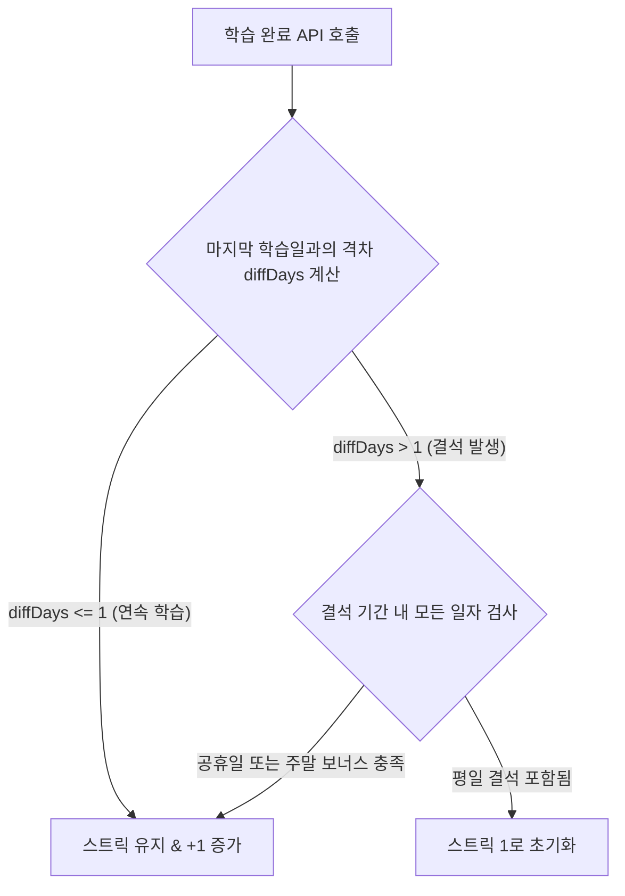

# teding 스트릭(Streak) 정책 및 계산 규칙

본 문서는 teding 서비스의 핵심 동기부여 요소인 스트릭(Streak)의 유지, 갱신 및 보너스 적용 규칙을 정의합니다.

---

## 1. 날짜 기준 및 오프셋 (KST 3시간 오프셋)

teding의 하루 기준은 **한국 표준시(KST, UTC+9)**를 기준으로 하되, 사용자의 생활 패턴을 고려하여 **오전 3시(오프셋 -3시간) 일일 리셋** 정책을 적용합니다.

- **논리적 날짜 계산식 (`getKSTDate`):**
  $$\text{LogicalTime} = \text{CurrentTime} + 9\text{ hours} - 3\text{ hours}$$
- **예시:**
    - KST 5월 20일 오전 02:30에 학습 완료 $\rightarrow$ 논리적 날짜는 **5월 19일**로 소급 적용.
    - KST 5월 20일 오전 03:01에 학습 완료 $\rightarrow$ 논리적 날짜는 **5월 20일**로 적용.

---

## 2. 스트릭 갱신 및 트리거 조건

- **트리거 시점:** 사용자가 학습 화면(Step 1 ~ Step 4)에서 **아무 단계나 완료하는 시점**에 `/api/streak` POST API가 트리거되어 갱신을 판단합니다.
- **학습 대상 제한 없음:** 오늘의 영상뿐만 아니라, **과거 영상(아카이브 복습 등)을 학습하더라도** 스트릭 갱신 대상에 포함됩니다.
- **중복 방지:** 동일한 논리적 날짜에 여러 번 API가 호출되더라도, 마지막 학습일(`last_study_date`)이 오늘 날짜와 같다면 추가 연산 없이 조기 반환되어 스트릭 수치가 유지됩니다.

---

## 3. 스트릭 유지 및 단절 판단 로직

마지막 학습일(`last_study_date`)과 오늘 날짜(`todayStr`) 사이의 격차 일수(`diffDays`)를 구한 뒤 아래 조건에 따라 스트릭 유지 여부를 결정합니다.

### 1) 연속 학습 판단 (`diffDays <= 1`)

- 마지막 학습일이 어제이거나 오늘인 경우 연속 학습으로 인정하여 현재 스트릭(`current_streak`)이 **1 증가**합니다.

### 2) 결석 발생 시 예외 처리 (공휴일 & 주말 보너스)

`diffDays > 1`인 경우, 결석한 모든 날짜에 대해 루프를 돌며 결석 허용 여부를 검사합니다. 단 한 날이라도 결석 허용 기준을 만족하지 못하면 스트릭은 **1로 초기화**됩니다.

- **공휴일 보너스:** 결석한 날이 법정 공휴일(천문연구원 API 기준)인 경우 결석이 무조선 허용됩니다.
- **주말 유동성 (Weekend Flexibility):**
    - **일요일 결석:** 토요일 학습 여부와 무관하게 일요일 결석은 항상 보너스일로 인정되어 스트릭이 유지됩니다.
    - **토요일 결석:** 토요일에 결석하더라도 **다음날(일요일)에 학습을 완료하거나 일요일이 공휴일인 경우** 토요일 결석이 허용됩니다.
- **평일 결석:** 공휴일이 아닌 평일(월~금) 결석이 단 하루라도 포함되어 있다면 스트릭은 유지되지 않고 **1로 초기화**됩니다.

---

## 4. UI 및 보너스 코인 표시 규칙

- **학습 스탬프:** 사용자가 각 단계를 완료한 시점의 **실제 완료 타임스탬프(`stepX_completed_at`)**를 파싱하여 해당 요일 타일에 실시간으로 도장을 채웁니다.
- **보너스 코인:** 학습하지 않은 날 중 아래 조건을 충족하는 날에는 주간 현황판에 **마리오 코인(보너스 코인)**이 표시됩니다.
    1.  **공휴일:** 날짜 선후 관계없이 공휴일명 정보가 있을 때 노출.
    2.  **일요일:** 일요일이고 오늘보다 과거 또는 오늘인 경우 노출.
    3.  **토요일:** 토요일에 결석했으나 일요일에 학습을 완료했거나 오늘이 일요일인데 학습 전인 경우(예고 코인) 노출.
